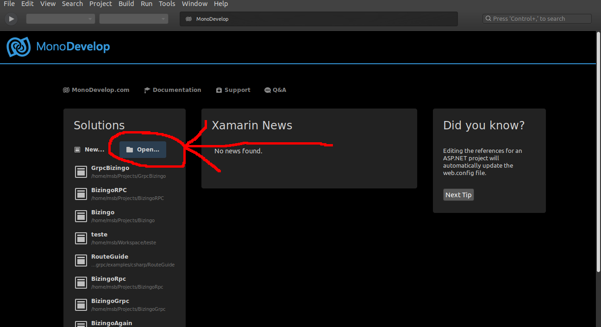
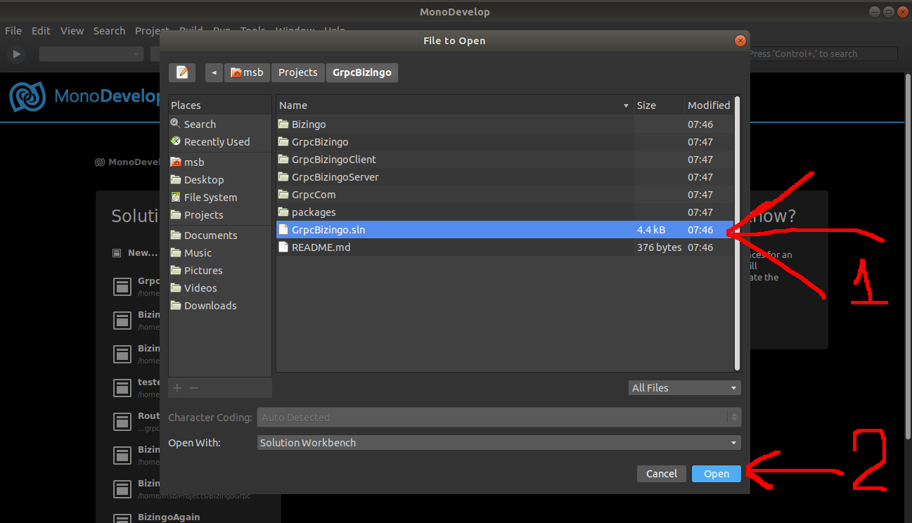
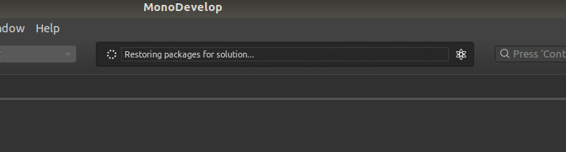
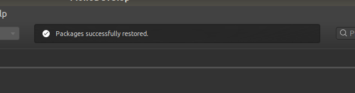
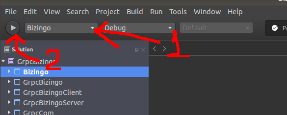

# sandbox_csharp_gtksharp/Bizingo

Bizingo is a tabletop game and this project is a attempt to make a socket distribuited
version of the game

## Tested OS's

Ubuntu 18

## install

# 1. install Monodevelop IDE following the steps from https://www.monodevelop.com/download/ (may take a while)

## For ubuntu 18:
```
sudo apt install apt-transport-https dirmngr

sudo apt-key adv --keyserver hkp://keyserver.ubuntu.com:80 --recv-keys 3FA7E0328081BFF6A14DA29AA6A19B38D3D831EF
echo "deb https://download.mono-project.com/repo/ubuntu vs-bionic main" | sudo tee /etc/apt/sources.list.d/mono-official-vs.list

sudo apt update

sudo apt-get install monodevelop
```
# 2. download dotnet core 2.1
## For ubuntu 18
```
wget -q https://packages.microsoft.com/config/ubuntu/19.04/packages-microsoft-prod.deb -O packages-microsoft-prod.deb

sudo dpkg -i packages-microsoft-prod.deb

sudo apt-get update

sudo apt-get install apt-transport-https

sudo apt-get update

sudo apt-get install dotnet-sdk-2.1
```
# 3. download this project and open the "Bizingo.sln" as a solution
## Open the solution

## Choose the .sln file

## Wait for the download of the packages


4. run the project
